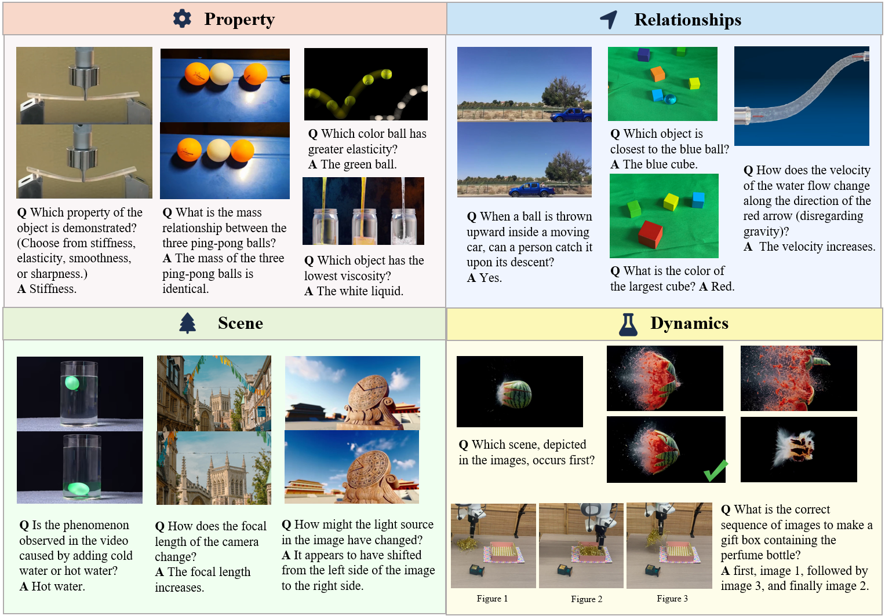
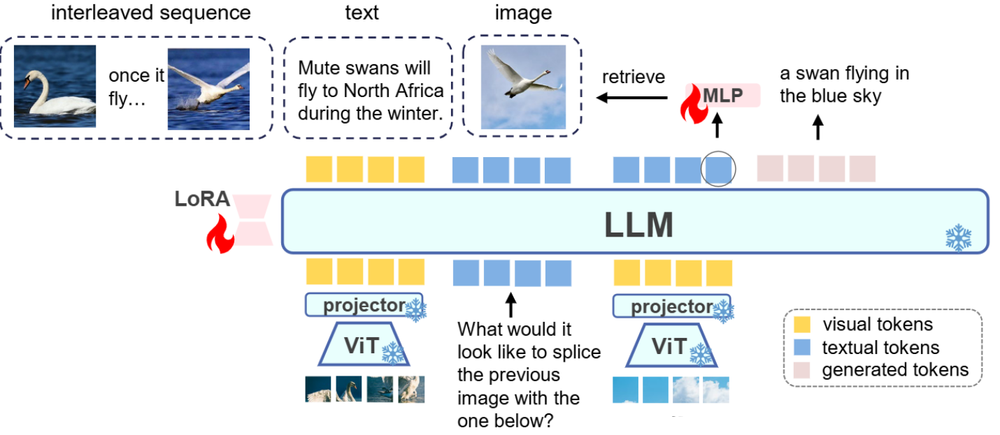
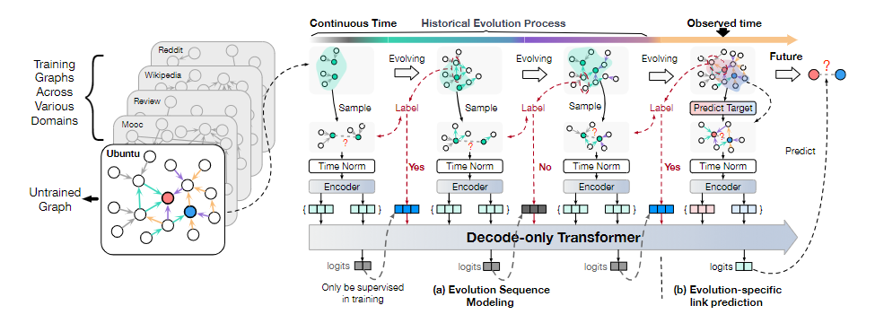
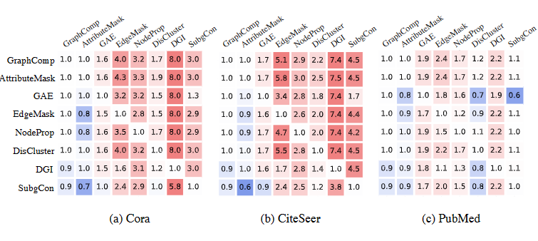
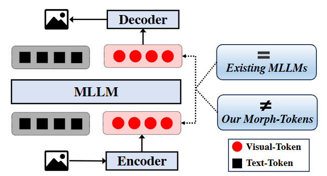
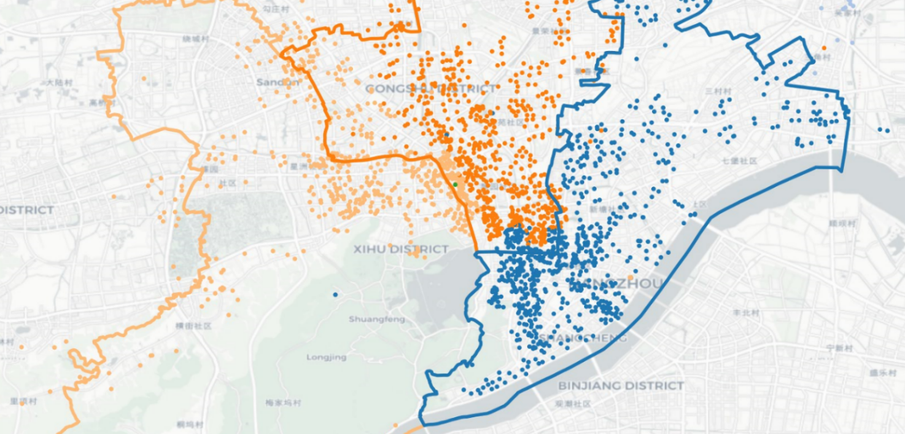
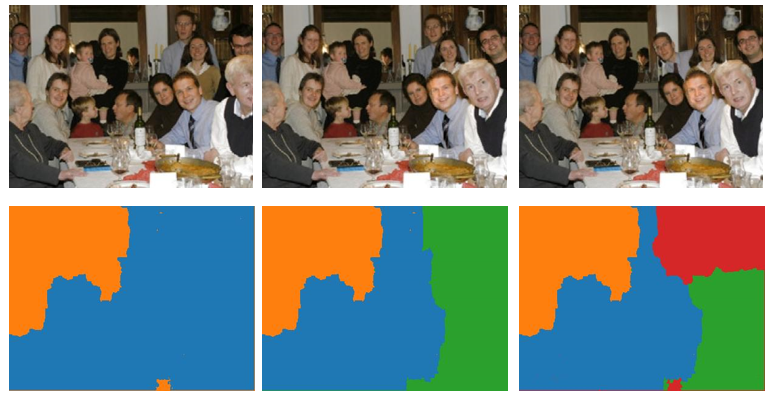
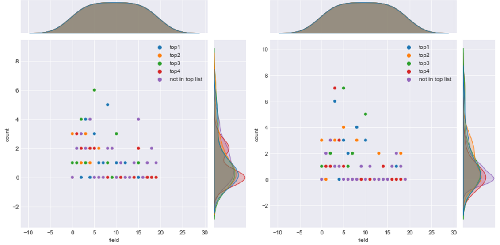

I'm an undergraduate student in Zhejiang University, major in Computer Science and minor in ACEE

My research focuses on **Vision-Language models** and extends in two directions:

- **Foundational research** on `Vision-Language models`, including fundamental exploration of methods like Transformer and Graph Neuron Network.

- **Applications** of Vision-Language models, primarily in two areas: `embodied agents` and `web agents`.

### Publications

<table>
    <tr>
        <td class="first-column">
                
        </td>
        <td class="second-column">
            PhysBench: Benchmarking and Enhancing Vision-Language Models for Physical World Understanding
            

                <strong>Wei Chow*</strong>,
                Jiageng Mao*, 
                Boyi Li, 
                Daniel Seita, 
                Vitor Guizilini, 
                Yue Wang
            

            

                
                
                  
                
            
 
        </td>
    </tr>
    <tr>
        <td class="first-column">
                
        </td>
        <td class="second-column">
            Unified Generative and Discriminative Training for Multi-modal Large Language Models
            

                <strong>Wei Chow</strong>,
                Juncheng Li, 
                Kaihang Pan, 
                Qifan Yu, 
                Hao Fei, 
                Zhiqi Ge, 
                Shuai Yang, 
                Siliang Tang, 
                Hanwang Zhang, 
                Qianru Sun
            

            

                
            
 
        </td>
    </tr>
    <tr>
        <td class="first-column">
                
        </td>
        <td class="second-column">
            One Graph Model for Cross-domain Dynamic Link Prediction
            

                Xuanwen Huang*
                <strong>Wei Chow*</strong>,
                Yize Zhu,
                Yang Wang,
                Ziwei Chai,
                Chunping Wang,
                Lei Chen,
                Yang Yang
            

            

                
            
 
        </td>
    </tr>
    <tr>
        <td class="first-column">
                
        </td>
        <td class="second-column">
            Exploring Correlations of Self-supervised Tasks for Graphs
            

                Taoran Fang,
                <strong>Wei Chow</strong>,
                Yifei Sun,
                Kaiqiao Han,
                Lvbin Ma,
                Yang Yang
            

            

                
                
            
 
        </td>
    </tr>
    <tr>
        <td class="first-column">
                
        </td>
        <td class="second-column">
            Auto-Encoding Morph-Tokens for Multimodal LLM
            

                Kaihang Pan,
                Siliang Tang,
                Juncheng Li,
                Zhaoyu Fan,
                <strong>Wei Chow</strong>,
                Shuicheng Yan,
                Tat-Seng Chua,
                Yueting Zhuang,
                Hanwang Zhang
            

            

                
                
            
 
        </td>
    </tr>
</table>

$^*$equal contribution

### Course Project

<table>
    <tr>
        <td class="first-column">
                
        </td>
        <td class="second-column">
            <a href="https://github.com/zjuerme/Second-hand_housing_transaction">Analysis on the relationship between second-hand housing transactions and business districts in Hangzhou's main urban area</a>
            

                [2024 Spring in ZJU] Real Estate Finance and Economics
            

        </td>
    </tr>
    <tr>
        <td class="first-column">
                
        </td>
        <td class="second-column">
            <a href="https://github.com/zjuerme/Computational-Photography">Interactive digital montage</a>
            

                [2024 Spring in ZJU] Computational Photography
            

        </td>
    </tr>
    <tr>
        <td class="first-column">
                
        </td>
        <td class="second-column">
            <a href="https://github.com/zjuerme/math-modeling-proj">Optimal matching of tutors and students</a>
            

                [2022 Fall in ZJU] Math Modeling
            

        </td>
    </tr>
</table>
### Academic Service

##### Challenge Organizer

[DEMON: Demonstrative Instruction Following Challenge](https://dcdmllm.github.io/DEMON-challenge/) (MM'2024)

**Reviewer**

ICLR'25

### Experience

<table style="width:100%; border:none; border-collapse:collapse;"> 
  <tr>
    <td style="width:10%; vertical-align:middle; text-align:center;">
      
    </td>
    <td style="width:90%; vertical-align:top; font-size:12px;">
      Zhejiang University 
      2021.08 ~ 2025.06 (expected) 
      First year GPA: 93.7/100 <strong>(rank 1/977)</strong> engerining department  
      Final GPA: GPA: 92.9/100 (rank 5/148) 
      B.Eng. in Computer Science and Technology, Minor in Advanced Class of Engineering Education (Honors)
    </td>
  </tr>
   <tr>
    <td style="width:6%; vertical-align:middle; text-align:center;">
      
    </td>
    <td style="width:90%; vertical-align:top; font-size:12px;">
   University of Hong Kong  
      2023.06 - 2023.12 
      Research Assistant in <a href="https://mmlab.ie.cuhk.edu.hk/people.html">MMLab</a> supervisored by Professor <a href="http://luoping.me/">Luo Ping</a>
    </td>
  </tr> 
</table>

### Misc.

In my free time, I like curving seal 🗿, playing tennis 🎾, cooking 🍳and taking photography 📷

