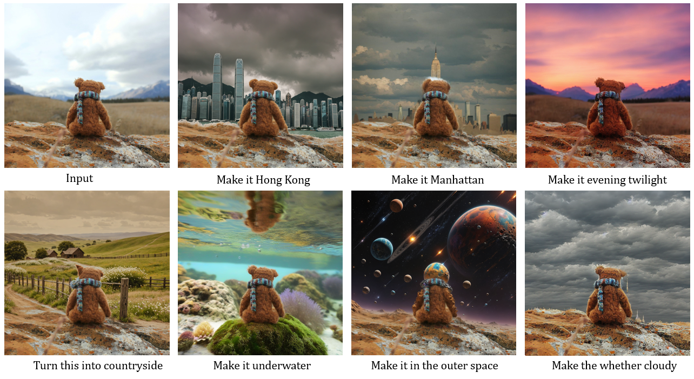
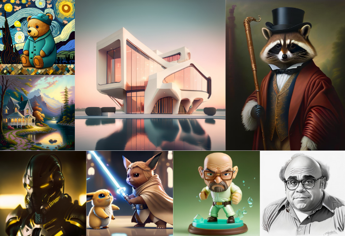
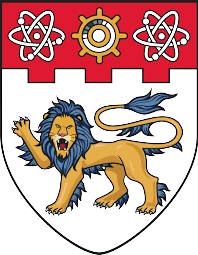

I'm an undergraduate student in Zhejiang University, major in Computer Science and minor in ACEE

My research focuses on **Vision-Language models** and extends in two directions:

- Diffusion (text2image, image edit)
- Robotics (vla)

  <svg width="500" height="330" style="border: 1px solid transparent;">
    <!-- VL Circle -->
    <circle cx="250" cy="120" r="100" fill="rgba(244,143,177,0.2)" stroke="rgb(244,143,177)" stroke-width="4"/>
    <text x="180" y="70" fill="rgb(244,143,177)" style="font-size: 18px; font-weight: bold;">Vision-Language</text>
    <text x="210" y="100" fill="black" style="font-size: 10px;">Sugar, NeurIPS’24</text>
    <text x="225" y="115" fill="black" style="font-size: 10px;">PhysBench</text>
    <!-- Robotics Circle -->
    <circle cx="170" cy="220" r="100" fill="rgba(255,202,100,0.2)" stroke="rgb(255,202,100)" stroke-width="4"/>
    <text x="100" y="210" fill="rgb(255,202,100)" style="font-size: 18px; font-weight: bold;">Robotics</text>
    <text x="115" y="250" fill="black" style="font-size: 10px;">VLT</text>
    <!-- Education Circle -->
    <circle cx="330" cy="220" r="100" fill="rgba(129,212,250,0.2)" stroke="rgb(129,212,250)" stroke-width="4"/>
    <text x="320" y="205" fill="rgb(129,212,250)" style="font-size: 18px; font-weight: bold;">Diffusion</text>
    <!-- Intersection Text -->
    <text x="325" y="230" fill="black" style="font-size: 10px;">AnyEdit</text>
    <text x="320" y="245" fill="black" style="font-size: 10px;">Meissonic</text>
  </svg>

### Publications

<table>
    <tr>
        <td class="first-column">
                
        </td>
        <td class="second-column">
            PhysBench: Benchmarking and Enhancing Vision-Language Models for Physical World Understanding
            

                <strong>Wei Chow*</strong>,
                Jiageng Mao*, 
                Boyi Li, 
                Daniel Seita, 
                Vitor Guizilini, 
                Yue Wang
            

            

                
            
 
        </td>
    </tr>
    <tr>
        <td class="first-column">
                
        </td>
        <td class="second-column">
            Unified Generative and Discriminative Training for Multi-modal Large Language Models
            

                <strong>Wei Chow</strong>,
                Juncheng Li, 
                Kaihang Pan, 
                Qifan Yu, 
                Hao Fei, 
                Zhiqi Ge, 
                Shuai Yang, 
                Siliang Tang, 
                Hanwang Zhang, 
                Qianru Sun
            

            

                
            
 
        </td>
    </tr>
    <tr>
        <td class="first-column">
                
        </td>
        <td class="second-column">
            One Graph Model for Cross-domain Dynamic Link Prediction
            

                Xuanwen Huang*
                <strong>Wei Chow*</strong>,
                Yize Zhu,
                Yang Wang,
                Ziwei Chai,
                Chunping Wang,
                Lei Chen,
                Yang Yang
            

            

                
            
 
        </td>
    </tr>
    <tr>
        <td class="first-column">
                
        </td>
        <td class="second-column">
            Exploring Correlations of Self-supervised Tasks for Graphs
            

                Taoran Fang,
                <strong>Wei Chow</strong>,
                Yifei Sun,
                Kaiqiao Han,
                Lvbin Ma,
                Yang Yang
            

            

                
                
            
 
        </td>
    </tr>
    <tr>
        <td class="first-column">
                
        </td>
        <td class="second-column">
            AnyEdit: Unified High-Quality Image Edit with Any Idea
            

                Qifan Yu*, 
                <strong>Wei Chow*</strong>, 
                Zhongqi Yue, 
                Kaihang Pan,
                Yang Wu, 
                Xiaoyang Wan, 
                Juncheng Li, 
                Siliang Tang, 
                Hanwang Zhang, 
                Yueting Zhuang
            

            

                
                
            
 
        </td>
    </tr>
    <tr>
        <td class="first-column">
                
        </td>
        <td class="second-column">
            Meissonic: Revitalizing Masked Generative Transformers for Efficient High-Resolution Text-to-Image Synthesis
            

                Jinbin Bai, 
                Tian Ye, 
                <strong>Wei Chow</strong>, 
                Enxin Song, 
                Qing-Guo Chen, 
                Xiangtai Li,
                Zhen Dong, 
                Lei Zhu, 
                Shuicheng Yan
            

            

                
                
                
                
            
 
        </td>
    </tr>
</table>

$^*$equal contribution

### Course Project

<table>
    <tr>
        <td class="first-column">
                
        </td>
        <td class="second-column">
            <a href="https://github.com/weichow23/Second-hand_housing_transaction">Analysis on the relationship between second-hand housing transactions and business districts in Hangzhou's main urban area</a>
            

                [2024 Spring in ZJU] Real Estate Finance and Economics
            

        </td>
    </tr>
    <tr>
        <td class="first-column">
                
        </td>
        <td class="second-column">
            <a href="https://github.com/weichow23/Computational-Photography">Interactive digital montage</a>
            

                [2024 Spring in ZJU] Computational Photography
            

        </td>
    </tr>
    <tr>
        <td class="first-column">
                
        </td>
        <td class="second-column">
            <a href="https://github.com/weichow23/math-modeling-proj">Optimal matching of tutors and students</a>
            

                [2022 Fall in ZJU] Math Modeling
            

        </td>
    </tr>
</table>
### Academic Service

##### Challenge Organizer

[DEMON: Demonstrative Instruction Following Challenge](https://dcdmllm.github.io/DEMON-challenge/) (MM'2024)

##### Reviewer

WWW'25, CVPR'25

### Experience

<table style="width:100%; border:none; border-collapse:collapse;"> 
  <tr>
    <td style="width:10%; vertical-align:middle; text-align:center;">
      
    </td>
    <td style="width:90%; vertical-align:top; font-size:12px;">
      Zhejiang University 
      2021.08 ~ 2025.06 (expected) 
        GPA: GPA: 92.9/100 (rank <b>1/301</b>) 
      B.Eng. in Computer Science and Technology, Minor in Advanced Class of Engineering Education (Honors) 
    	supervisored by Professor <a href="https://person.zju.edu.cn/juncheng">Juncheng Li</a>
      </td>
  </tr>
  <tr>
    <td style="width:6%; vertical-align:middle; text-align:center;">
      
    </td>
    <td style="width:90%; vertical-align:top; font-size:12px;">
   University of Hong Kong  
      2023.06 - 2023.12 
      Research Assistant in <a href="https://mmlab.ie.cuhk.edu.hk/people.html">MMLab</a> supervisored by Professor <a href="http://luoping.me/">Luo Ping</a>
    </td>
  </tr>
   <tr>
    <td style="width:3%; vertical-align:middle; text-align:center;">
      
    </td>
    <td style="width:90%; vertical-align:top; font-size:12px;">
   Nanyang Technological University  
      2023.12 - 2024.6 
      Intern supervisored by Professor <a href="https://mreallab.github.io/index.html">Hanwang Zhang</a>
    </td>
  </tr> 
  <tr>
    <td style="width:6%; vertical-align:middle; text-align:center;">
      
    </td>
    <td style="width:90%; vertical-align:top; font-size:12px;">
   University of Southern California  
      2024.06 - Present 
      Intern supervisored by Professor <a href="https://yuewang.xyz/">Yue Wang</a>
    </td>
  </tr> 
</table>

### Misc.

In my free time, I like curving seal 🗿, playing tennis 🎾, cooking 🍳and taking photography 📷

