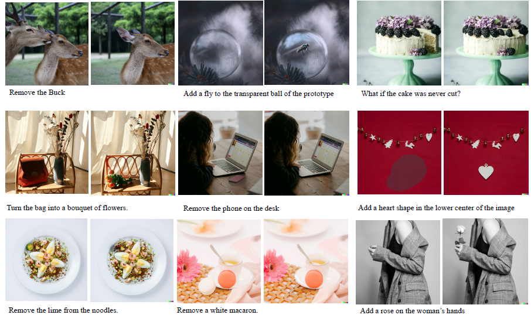
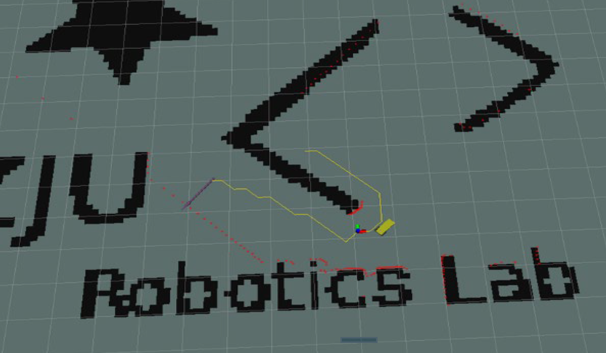

I'm an undergraduate student in Zhejiang University.

My goal is to enhance the physical perception capabilities of Vision-Language Models (VLMs) to enable their effective operation as intelligent embodied agents in the physical world. Additionally, I am interested in physics-adherent generation.

### Publications

<table>
    <tr>
        <td class="first-column">
                
        </td>
        <td class="second-column">
            PhysBench: Benchmarking and Enhancing Vision-Language Models for Physical World Understanding
            

                <strong>Wei Chow*</strong>,
                Jiageng Mao*, 
                Boyi Li, 
                Daniel Seita, 
                Vitor Guizilini, 
                Yue Wang
            

            

                
                
                
            
 
        </td>
    </tr>
    <tr>
        <td class="first-column">
                
        </td>
        <td class="second-column">
            Unified Generative and Discriminative Training for Multi-modal Large Language Models
            

                <strong>Wei Chow</strong>,
                Juncheng Li, 
                Qifan Yu, 
                Kaihang Pan, 
                Hao Fei, 
                Zhiqi Ge, 
                Shuai Yang, 
                Siliang Tang, 
                Hanwang Zhang, 
                Qianru Sun
            

            

                
                
            
 
        </td>
    </tr>
    <tr>
        <td class="first-column">
                
        </td>
        <td class="second-column">
            One Graph Model for Cross-domain Dynamic Link Prediction
            

                Xuanwen Huang*
                <strong>Wei Chow*</strong>,
                Yize Zhu,
                Yang Wang,
                Ziwei Chai,
                Chunping Wang,
                Lei Chen,
                Yang Yang
            

            

                
                
               
            
 
        </td>
    </tr>
    <tr>
        <td class="first-column">
                
        </td>
        <td class="second-column">
            Exploring Correlations of Self-supervised Tasks for Graphs
            

                Taoran Fang,
                <strong>Wei Chow</strong>,
                Yifei Sun,
                Kaiqiao Han,
                Lvbin Ma,
                Yang Yang
            

            

                
            
 
        </td>
    </tr>
    <tr>
        <td class="first-column">
                
        </td>
        <td class="second-column">
            AnyEdit: Mastering Unified High-Quality Image Editing for Any Idea
            

                Qifan Yu*, 
                <strong>Wei Chow*</strong>, 
                Zhongqi Yue, 
                Kaihang Pan,
                Yang Wu, 
                Xiaoyang Wan, 
                Juncheng Li, 
                Siliang Tang, 
                Hanwang Zhang, 
                Yueting Zhuang
            

            

                
               
                
                
            
 
        </td>
    </tr>
        <tr>
        <td class="first-column">
                
        </td>
        <td class="second-column">
            HumanEdit: A High-Quality Human-Rewarded Dataset for Instruction-based Image Editing
            

                Jinbin Bai*, 
                <strong>Wei Chow*</strong>, 
                Ling Yang, 
                Xiangtai Li,
                Juncheng Li,
                Hanwang Zhang, 
                Shuicheng Yan
            

            

                
                
                
            
 
        </td>
    </tr>
    <tr>
        <td class="first-column">
                
        </td>
        <td class="second-column">
            Meissonic: Revitalizing Masked Generative Transformers for Efficient High-Resolution Text-to-Image Synthesis
            

                Jinbin Bai, 
                Tian Ye, 
                <strong>Wei Chow</strong>, 
                Enxin Song, 
                Qing-Guo Chen, 
                Xiangtai Li,
                Zhen Dong, 
                Lei Zhu, 
                Shuicheng Yan
            

            

                
                
                
                
            
 
        </td>
    </tr>
</table>

$^*$equal contribution

### Course Project

<table>
     <tr>
        <td class="first-column">
                
        </td>
        <td class="second-column">
            <a href="https://github.com/weichow23/Wheeled-Robot-Enhancement-and-Practice">Wheeled robots tracking and navigating in ROS and real environments (such as A star, ICP etc.)</a>
            

                [2023 Summer in ZJU] Wheeled Robot Enhancement and Practice
            

        </td>
    </tr>
    <tr>
        <td class="first-column">
                
        </td>
        <td class="second-column">
            <a href="https://github.com/weichow23/Second-hand_housing_transaction">Analysis on the relationship between second-hand housing transactions and business districts in Hangzhou's main urban area</a>
            

                [2024 Spring in ZJU] Real Estate Finance and Economics
            

        </td>
    </tr>
    <tr>
        <td class="first-column">
                
        </td>
        <td class="second-column">
            <a href="https://github.com/weichow23/Computational-Photography">Interactive digital montage</a>
            

                [2024 Spring in ZJU] Computational Photography
            

        </td>
    </tr>
    <tr>
        <td class="first-column">
                
        </td>
        <td class="second-column">
            <a href="https://github.com/weichow23/math-modeling-proj">Optimal matching of tutors and students</a>
            

                [2022 Fall in ZJU] Math Modeling
            

        </td>
    </tr>
</table>

### Academic Service

##### Challenge Organizer

[DEMON: Demonstrative Instruction Following Challenge](https://dcdmllm.github.io/DEMON-challenge/) (MM'2024)

##### Reviewer

WWW'25

### Experience

<table cellspacing="17"> 
    <tbody>
        <tr>
            <td width="15%">
                
            </td>
            <td colspan='3'>
                
Zhejiang University

                
2021.8 - 2025.6 (expected)

                
B.Eng. in Computer Science and Technology, GPA: 92.9/100 (rank <b>1/301</b>) 
      Minor in Advanced Class of Engineering Education (Honors)					

            </td>
        </tr>       
        <tr>
             <td width="15%">
                 
            </td>
            <td>
                
University of Oxford

                
2024.8 - 2024.9

                
Visiting Student

            </td>
            <td width="15%">
                
            </td>
            <td>
                
University of Hong Kong

                
2023.6 - 2023.11

                
 Research Assitant supervised by Professor <a href="http://luoping.me/">Ping Luo</a>

            </td>
        </tr>
        <tr>
            <td width="15%">
                
            </td>
            <td>
                
Nanyang Technological University

                
2023.12 - 2024.6

                
Intern supervised by Professor <a href="https://mreallab.github.io/index.html">Hanwang Zhang</a>

            </td>
            <!--USC-->
            <td width="15%">
                
            </td>
            <td>
                
University of Southern California

                
2024.6 - Present

                
Intern supervised by Professor <a href="https://yuewang.xyz/">Yue Wang</a>

            </td>
        </tr>
        <tr>
            <!--ByteDance-->
            <td width="15%">
                
            </td>
            <td>
                
ByteDance

                
2024.1 - 2024.8

                
Intern

            </td>
        </tr>
    </tbody>
</table>

### Misc.

In my free time, I like curving seal 🗿, playing tennis 🎾, cooking 🍳and taking photography 📷
