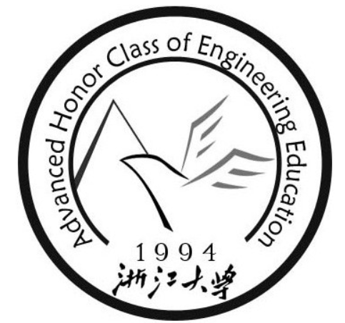
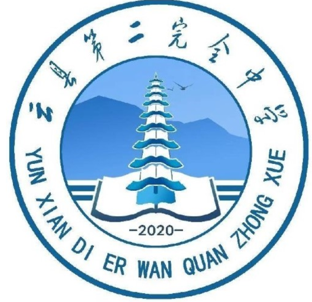



Education
======
  B.S. in **Computer Science and Technology** , **Zhejiang University**

- 2021.8 - 2025.6  (expected)

    Minior in Advanced Class of Engineering Education(**ACEE**) , Chu Kochen Honors College, **Zhejiang University**, 2025 (expected)

Work Experience
======

   **Teaching Assistant** in **Zhejiang University**

[211G0239]  **Introduction to Computer Science** (for international students) lectured by Prof.[Jiangming Ji](https://person.zju.edu.cn/11111)  2023.9 - 2024.1 

[211G0300]  **Fundamentals of Computer Science (B)** lectured by Prof.[Duanqing Xu](https://person.zju.edu.cn/0092050/584384.html)  2023.9 - 2024.1

[2114N001]  **Introduction to Artificial Intelligence**  lectured by Prof. [Congfu Xu](https://www.baidu.com/link?url=VB3VMqLllzvBXDNOWEe-O03bJAZXttz89SP3I2nAUZl3KbNzs9LGVJtJ07hU94x1&wd=&eqid=fe41340c0000339c000000066502f523)  2023.9 - 2024.1

   **WeSearch Student** in **Westlake University**  

- 2022.11 - 2023.5
- Supervisor: Professor [Zhang Yue](https://scholar.google.com/citations?hl=zh-CN&user=6hA7WmUAAAAJ)

   **Research Assistant** in **HongKong University** [MMLab](https://mmlab.ie.cuhk.edu.hk/people.html)

- 2023.6 - now
- Supervisor: Professor [Luo Ping](http://luoping.me/)

# Other experience

  **Korea University** Summer Course : Introduction to Computer Science

  Yunxian No. 2 Middle School, Yunnan Province Supporting Teaching

  **Citadel and Citadel Security** ACPC Visiting Student

# Honors

- 2021-2022 Undergraduate Students **National Scholarships**

- 2023 Interdisciplinary Contest In Modeling  (**ICM**) Meritorious Winner
