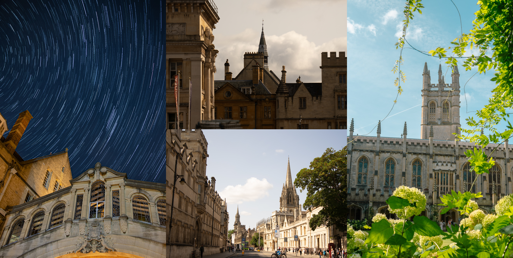
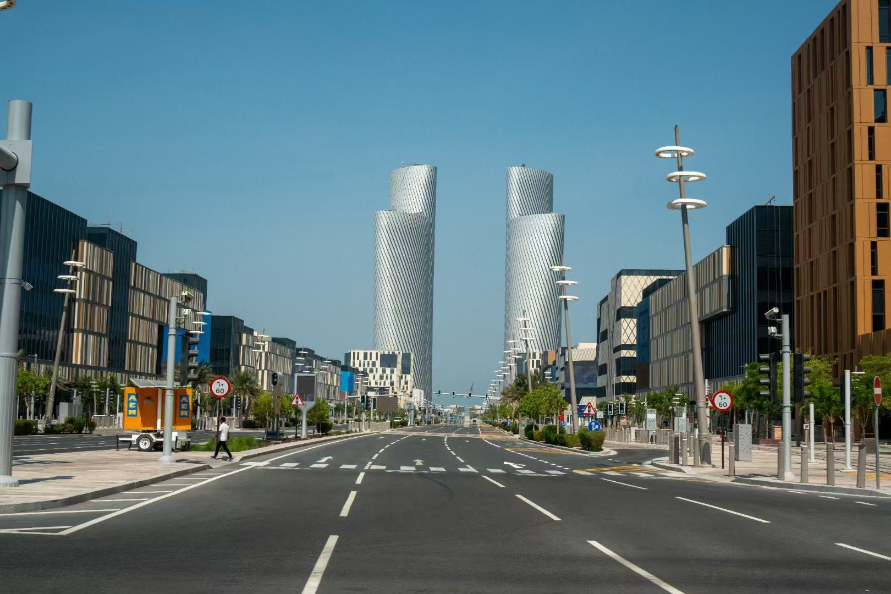

 I’m someone who loves to observe and explore! Below are some of the beautiful places✨ I’ve visited, captured through the lens of my camera📸. 
My work goal is to enable AI 🤖 to perceive, appreciate, and cherish everything in the world, just like humans do.My goal at work is to enable AI to perceive, appreciate, and be grateful for everything in the world🌍, just like humans👨. 

**Vienna, Austria, 2024 summer** 

**Oxford, UK, 2024 summer** 

Every day spent with my dear friends at Oxford has been the happiest time of my undergraduate years, a memory I will cherish for a lifetime.

**Doha, Qatar, 2024 summer** 

**Hangzhou, China, daily life during my undergraduate life**

